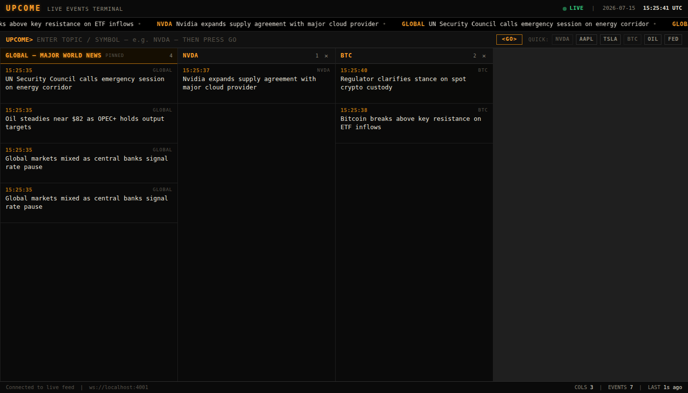

# UPCOME — Live Events Terminal

A **Bloomberg-style terminal for live events across the world**. Subscribe to a
topic and it opens a column; that column fills with news for the topic as it
crosses the wire. A pinned **GLOBAL** column for major world news is always on.

Built with the latest **Next.js 16** (App Router) and **Tailwind CSS v4**.



## The wire format

The terminal connects to a WebSocket feed and renders JSON frames of the form:

```json
{
  "topic": "NVDA",
  "event": "NVDA CEO Sells $10,000 in shares",
  "more-info": "https://upcomenew.io/234"
}
```

- `topic` — the symbol/topic the event belongs to. It's routed to the matching
  column (case-insensitive). Events with topic `GLOBAL` feed the pinned column.
- `event` — the headline shown in the feed.
- `more-info` — a link to the full story (surfaced on row hover).

The client may also send `{ "action": "subscribe", "topics": ["NVDA", "BTC"] }`
when the user's columns change; feeds that honor it can filter, and
broadcast-only feeds can simply ignore it.

## Getting started

```bash
npm install

# Run the app + the bundled mock feed together:
npm run dev:all
# → http://localhost:3000  (feed: ws://localhost:4001)
```

Or run them separately:

```bash
npm run mock   # mock WebSocket feed on ws://localhost:4001
npm run dev    # Next.js dev server on http://localhost:3000
```

### Pointing at a real feed

Set the feed URL (copy `.env.example` to `.env.local`):

```bash
NEXT_PUBLIC_UPCOME_WS_URL=wss://feed.your-upcome-host.io
```

> `NEXT_PUBLIC_*` values are inlined at build time — set it before `npm run build`.

If the feed can't be reached after a few attempts, the terminal drops into a
built-in **demo feed** (generated in the browser) so it's never blank — the
status pill in the header shows `DEMO FEED` when that happens.

## Using the terminal

- **Open a column** — type a topic in the command line (`UPCOME>`) and press
  **GO** / Enter, or click a quick-add chip (NVDA, AAPL, TSLA, …).
- **Close a column** — the `×` in a column header. The **GLOBAL** column is
  pinned and can't be closed.
- **Open a story** — hover a row and click `more-info ↗`.
- Your column layout is saved to `localStorage` and restored on reload.

The header shows connection state and a live UTC clock; the footer shows the
feed URL, column/event counts, and time since the last message.

## Project layout

```
server/mock-ws.mjs          Mock WebSocket feed (emits the wire format)
src/app/                    App Router entry, layout, global theme
src/components/
  Terminal.tsx              Orchestrates columns, state, and the feed
  TopBar.tsx / StatusBar.tsx  Header + footer chrome
  Ticker.tsx                Scrolling headline marquee
  CommandBar.tsx            Bloomberg-style command line + quick-add
  Column.tsx / EventRow.tsx Per-topic feed column and rows
src/lib/
  types.ts                  Wire + internal types, event normalization
  useUpcomeSocket.ts        WebSocket connection, reconnect, demo fallback
  mockEvents.ts             Headline catalog for the in-browser demo feed
```

## Production build

```bash
npm run build
npm run start
```
